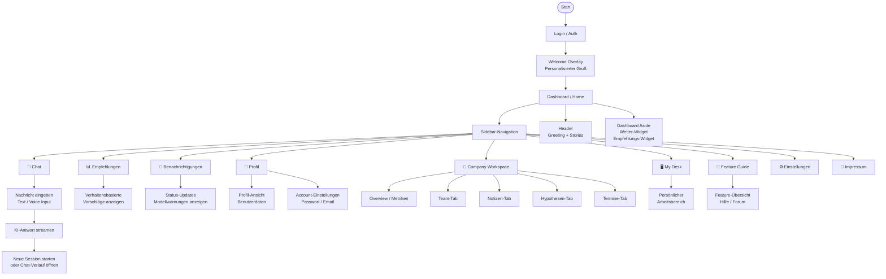

# App-Struktur Flowchart

```mermaid
flowchart TD
    A([Start]) --> B[Login / Auth]
    B --> C[Welcome Overlay\nPersonalisierter Gruß]
    C --> D[Dashboard / Home]

    D --> E[Sidebar-Navigation]

    E --> F[💬 Chat]
    E --> G[📊 Empfehlungen]
    E --> H[🔔 Benachrichtigungen]
    E --> I[👤 Profil]
    E --> J[🏢 Company Workspace]
    E --> K[🖥 My Desk]
    E --> L[📖 Feature Guide]
    E --> M[⚙️ Einstellungen]
    E --> N[📜 Impressum]

    F --> F1[Nachricht eingeben\nText / Voice Input]
    F1 --> F2[KI-Antwort streamen]
    F2 --> F3[Neue Session starten\noder Chat-Verlauf öffnen]

    G --> G1[Verhaltensbasierte\nVorschläge anzeigen]

    H --> H1[Status-Updates\nModellwarnungen anzeigen]

    I --> I1[Profil-Ansicht\nBenutzerdaten]
    I --> I2[Account-Einstellungen\nPasswort / Email]

    J --> J1[Overview / Metriken]
    J --> J2[Team-Tab]
    J --> J3[Notizen-Tab]
    J --> J4[Hypothesen-Tab]
    J --> J5[Termine-Tab]

    K --> K1[Persönlicher\nArbeitsbereich]

    L --> L1[Feature-Übersicht\nHilfe / Forum]

    D --> D1[Header\nGreeting + Stories]
    D --> D2[Dashboard Aside\nWetter-Widget\nEmpfehlungs-Widget]
```
